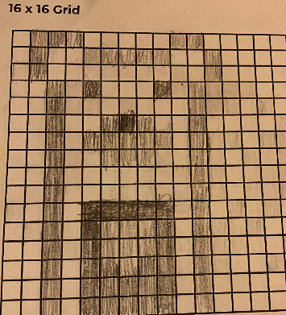

# Unit 1 - Asphalt Art

## Introduction

Cities use asphalt art to improve public safety, inspire their residents and visitors, and brighten communities. Your goal is to create asphalt art to revitalize The Neighborhood and bring the community together with the help of the Painter.

## Requirements

Use your knowledge of object-oriented programming, algorithms, the problem solving process, and decomposition strategies to create asphalt art:
- **Create a new subclass** – Create at least one new subclass of the PainterPlus class that is used for a component of the asphalt art design.
- **Plan an algorithm** – Use the problem solving process and decomposition strategies to plan an algorithm that incorporates a combination of sequencing, selection, and/or iteration.
- **Write a method** – Write at least one method in a PainterPlus subclass that contributes to a component of the asphalt art design.
- **Document your code** – Use comments to explain the purpose of the methods and code segments.

## Notes: Neighborhood & Painter Class

This project was created on Code.org's JavaLab platform using the built in Neightborhood GUI output. To test and edit this project you must build in Code.org's JavaLab with the Neighborhood GUI enabled. For reference to the Painter class documentation, [you can read more here.](https://studio.code.org/docs/ide/javalab/classes/Painter)

## Output:

   
## Reflection

1. Describe your project.

   - My project is a program that uses methods, while loops, and classes to paint a bear. It is on a 16x16 grid and was changed from the orignial concept to the drawing that it became. Originally, I wanted to use my program to paint an otter, however as I began my code and saw how the colors had an effect on how the animal itself looked, I decided it would look better as a bear.

2. What are two things about your project that you are proud of?

   - One thing I am proud of is incorporating while loops. Although we did learn how to use while loops last year, I was a bit confused on how to use one in my code. However, I found a scenerio that allowed me to decrease repetition while still completing the same task. Second, I am proud of finding new ways to incorperate ideas. I wanted to make my code as effecient as possible, and organized as well. I felt that my program did achieve this.

3. Describe something you would improve or do differently if you had an opportunity to change something about your project.

   - I would want to improve the efficiency of the program by eliminating repition that wasn't necessary. I would also want to improve the design, to allow the colors and grid to accomodate the design of an otter, instead of a bear.